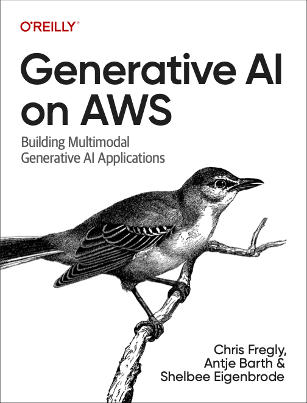

Welcome to the GitHub repo for O'Reilly's "Generative AI on AWS" by Chris Fregly, Antje Barth, and Shelbee Eigenbrode.

* Chapter 1 - Generative AI Use Cases, Fundamentals, Project Lifecycle
* Chapter 2 - Prompt Engineering and In-Context Learning
* Chapter 3 - Large-Language Foundation Models
* Chapter 4 - Quantization and Distributed Computing
* Chapter 5 - Fine-Tuning and Evaluation
* Chapter 6 - Parameter-efficient Fine Tuning (PEFT)
* Chapter 7 - Fine-tuning using Reinforcement Learning with RLHF
* Chapter 8 - Optimize and Deploy Generative AI Applications
* Chapter 9 - Retrieval Augmented Generation (RAG) and Agents
* Chapter 10 - Multimodal Foundation Models
* Chapter 11 - Controlled Generation and Fine-Tuning with Stable Diffusion
* Chapter 12 - Amazon Bedrock Managed Service for Generative AI
